# 概要と仕様

フリマアプリクローンです。

## ユーザー種別

- 一般ユーザー

## 出品

商品を出品します。以下の項目を設定できます。

- 商品名
- タグ
- 商品詳細
- 価格
- 画像 URL

### 出品履歴

現在出品している、または取引が完了した出品を一覧できます。

## 商品一覧

他の出品者が出品した商品を一覧できます。

## 購入

他の出品者が出品した商品を購入できます。

## 取引

出品者と購入者がやりとりを行うページです。

### 取引ステータス



取引の状況は以下のステータスで管理されています。

```
支払い待ち > 発送待ち > 受け取り待ち > 完了
```

また、支払いが完了するまではキャンセルすることが出来ます。
